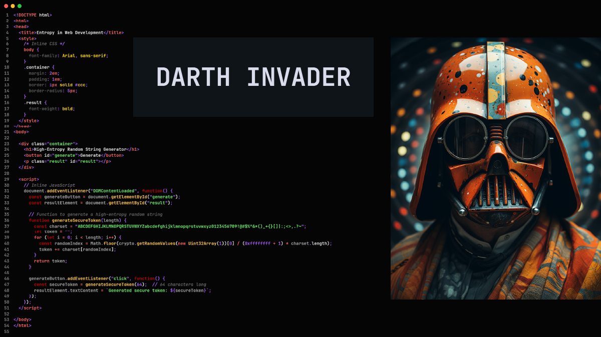
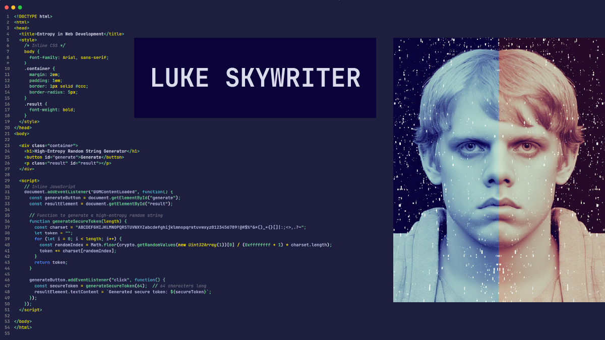
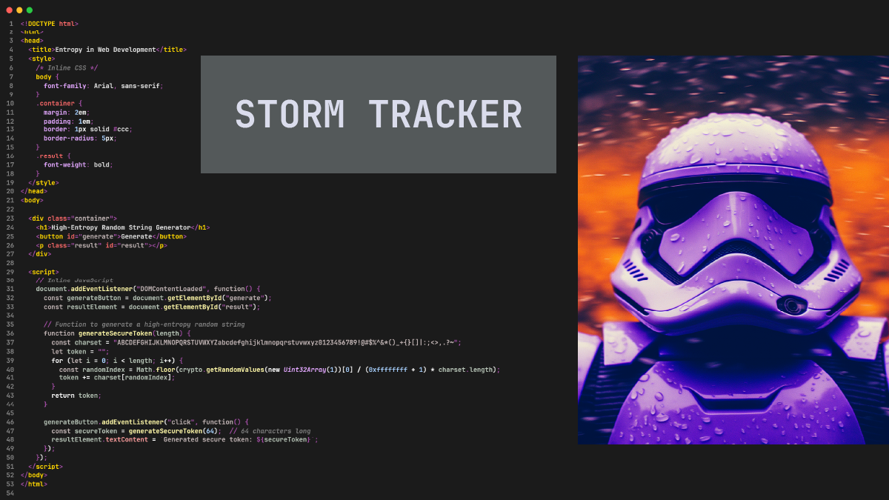
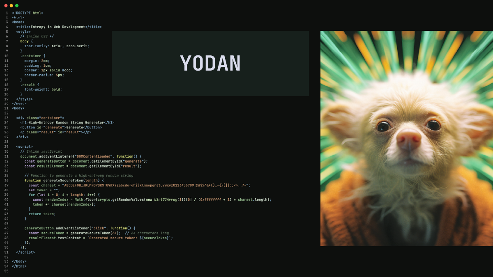
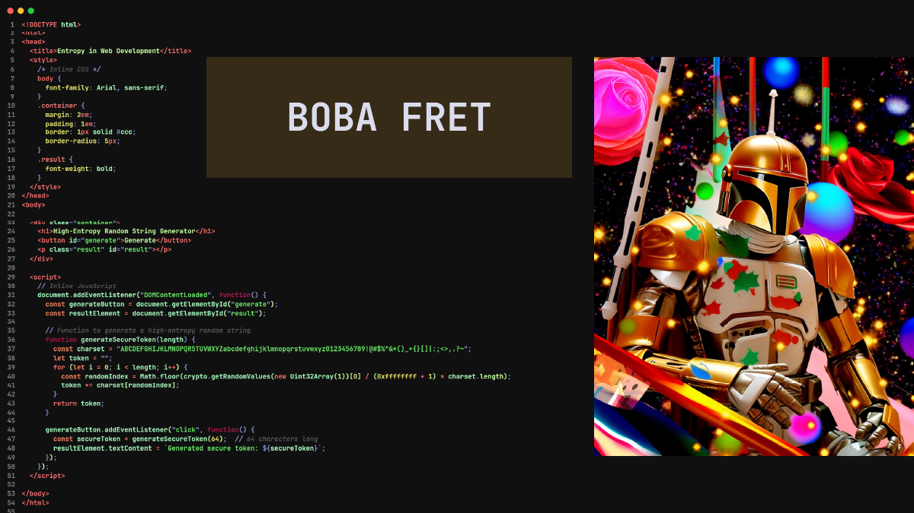
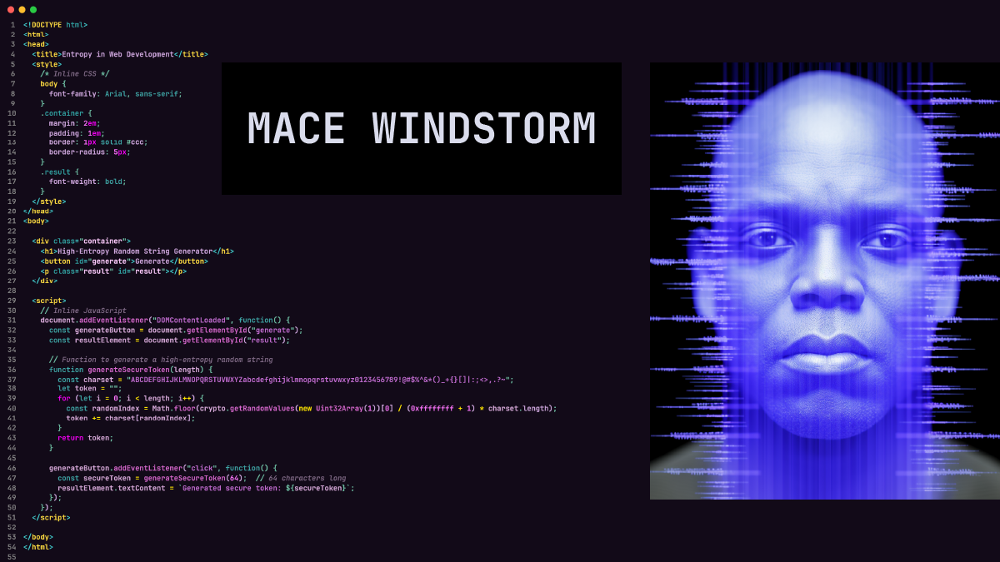
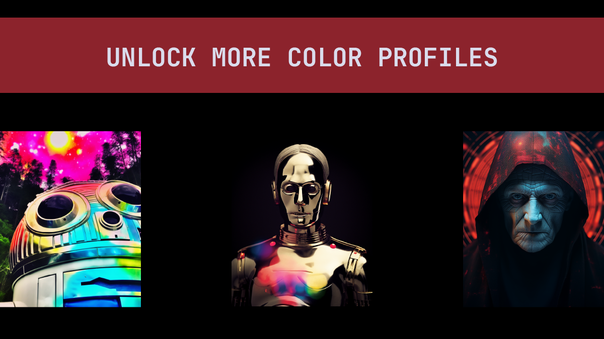

# Galactic Glow 🌌

A VSCode theme extension that brings the legendary galactic saga characters to your coding universe through Galactic Glow. Transform your coding environment into a galactic saga and embrace the shades of Darth Invader, Luke Skywriter, and more as you traverse through the code cosmos.

✨ Experience a truly immersive coding journey as Galactic Glow meticulously harmonizes every element—from the sidebar to the integrated terminal—with the chosen character theme.🚀


[](https://www.gnu.org/licenses/agpl-3.0)


## Usage 🚀

Switch between different character themes to experience the unique ambiance each one brings to your coding environment. Preview the themes below to find your favorite!















- **Mace Windstorm: unlocked** 🌠
<br>
- **Artie-Detoo: 300 installs, or three 5 star ratings. 🛸**
<br>
- **Cee-Threepo: 300 installs, or three 5 star ratings. 🤖** 
<br>
- **Darth Insidious: Details pending. Reach one cosmic achievements to access. 🪐** 
<br>

## Table of Contents

- [Installation](#installation)
- [Recommended Font: JetBrains Mono](#recommended-font-jetbrains-mono)
  - [How to Install JetBrains Mono](#how-to-install-jetbrains-mono)
  - [Setting JetBrains Mono in VSCode](#setting-jetbrains-mono-in-vscode)
- [Special Instructions for Linux Users](#special-instructions-for-linux-users)
  - [Enabling Custom Components](#enabling-custom-components)
- [Features](#features)
- [Support](#support)
- [Contributing](#contributing)
- [License](#license)
- [Acknowledgments](#acknowledgments)
- [Changelog](#changelog)
- [FAQs](#faqs)
- [Contact](#contact)

## Installation 💾

1. Open the Extensions sidebar in VSCode. `View → Extensions`.
2. Search for `Galactic Glow`, and install it.
3. After installation, select the theme by navigating to `File → Preferences → Color Theme → Galactic Glow`.

## Recommended Font: JetBrains Mono ✍️

To elevate your coding experience with Galactic Glow, we recommend using the JetBrains Mono font. This font is designed specifically for developers, offering improved readability and a modern, clean aesthetic that complements the theme's character-inspired styles.

### How to Install JetBrains Mono

1. Download the latest version of JetBrains Mono from the [official website](https://www.jetbrains.com/lp/mono/).
2. Unzip the downloaded archive.
3. Install the font on your system:
   - **Windows**: Right-click on the `.ttf` files and select "Install".
   - **macOS**: Double-click on the `.ttf` files and press "Install Font".
   - **Linux**: Place the `.ttf` files into `~/.local/share/fonts` (or `/usr/share/fonts` to install fonts system-wide) and run `fc-cache -f -v`.

### Setting JetBrains Mono in VSCode

After installing the font, set it as your editor's font in VSCode:

1. Open VSCode settings (`Ctrl + ,` or `Cmd + ,` on macOS).
2. Search for `Font Family`.
3. Enter `JetBrains Mono` as the first choice in the font list.
4. Ensure `Editor: Font Ligatures` is enabled to enjoy the full visual experience.

Below are my personal settings:
   ```json
    "editor.fontSize": 16,
    "editor.fontFamily": "'JetBrains Mono', 'Courier New', monospace",
    "editor.fontWeight": "bold", 
    "editor.fontLigatures": true,
    "terminal.integrated.fontSize": 16,
   ```


## Special Instructions for Linux Users 🐧

For Linux users, to fully experience the Galactic Glow theme as intended, you may need to enable certain features manually due to differences in how themes interact with the VSCode UI on Linux.

### Enabling Custom Components

1. Open the Command Palette with `Ctrl+Shift+P`.
2. Type `Preferences: Open Settings (JSON)` and press `Enter`.
3. Add or modify the following settings:
   ```json
   "window.titleBarStyle": "custom"
   ```
4. Save the settings and restart VSCode.


## Features 🌟

Galactic Glow is a multi-bundle theme extension created with the intention to visualize the essence of iconic galactic saga characters via coloring. Each character theme offers a unique coding ambiance to enhance your VSCode experience.


## Support 🚑

Encountered a bug or have a suggestion? Open an issue [here](https://github.com/EntropyQuality/galactic-glow/issues) and we'll look into it.

## Contributing 🤝

We welcome contributions from the community! If you'd like to contribute, feel free to fork the repository and submit a pull request. For major changes, please open an issue first to discuss what you would like to change.

## License ⚖️

This project is licensed under the GNU Affero General Public License v3.0 (AGPL-3.0) - see the [LICENSE.txt](LICENSE.txt) file for details. 


## Acknowledgments 👏

A special thanks to all the iconic characters from the galactic saga that inspired the color palettes of Galactic Glow.

## Changelog 📅

- 0.1.5 (2023-10-12): Improved syntax highlighting for multiple characters; Improved the README manual for installing fonts and advanced linux integration"
- 0.1.4 (2023-10-12): Improved syntax highlighting for all the characters.
- 0.1.3 (2023-10-12): Color changes to Darth Invader and Luke Skywriter theme for better syntax highlighting and menu navigation - improved the colors to align more with the character; Minor changes to Boba Fret and Mace Windstorm | Extended range of colors for syntax highlighting
- 0.1.2 (2023-10-12): Minor changes to README.md file
- 0.1.1 (2023-10-12): New character theme introduction: Mace Windstorm.
- 0.1.0 (2023-10-12): Initial release of Galactic Glow.

## FAQs ❓

- **How do I switch between different character themes?**
  - Navigate to `File → Preferences → Color Theme` and select your desired character theme from Galactic Glow.

## Contact

Feel free to reach out and follow on [GitHub](https://github.com/EntropyQuality).

